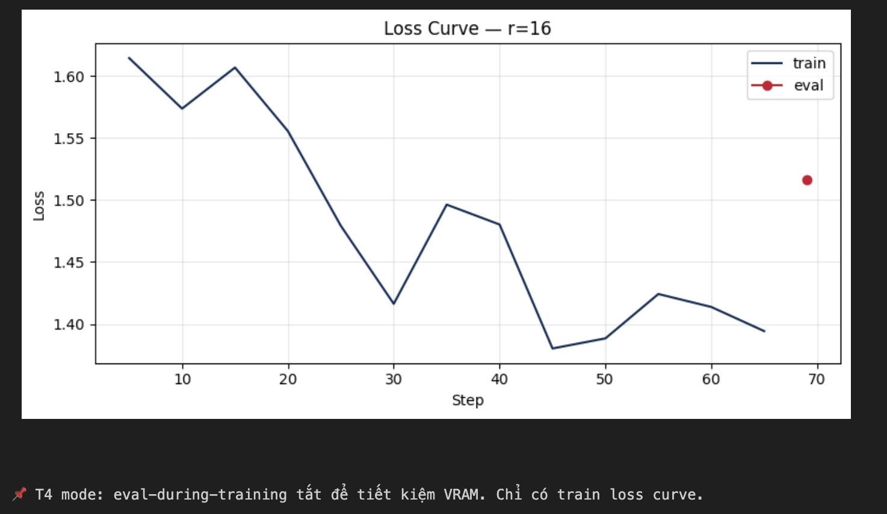

# Lab 21 — Evaluation Report

**Học viên**: <Nguyễn Hồ Diệu Linh> — <2A202600567>

**Ngày nộp**: <26/6/2026>

**Submission option**: B (HF Hub)

## 1. Setup
- **Base model**: `unsloth/Qwen2.5-3B-bnb-4bit`
- **Dataset**: `5CD-AI/Vietnamese-alpaca-gpt4-gg-translated`, 200 samples (180 train + 20 eval)
- **max_seq_length**: 1024 (p95 = 562, rounded up to power of 2)
- **GPU**: Tesla T4, 15.6 GB VRAM
- **Training cost**: $0.08 (~13.1 phút @ $0.35/hr)
- **HF Hub link** (nếu Option B): https://huggingface.co/linhnguyennnn/qwen2.5-3b-vi-lab21-r16

## 2. Rank Experiment Results

| Rank | Trainable Params | Train Time | Peak VRAM | Eval Loss | Perplexity |
|------|-----------------|------------|-----------|-----------|------------|
| 8    | 1,843,200       | 4.3 min    | 7.2 GB    | 1.5577    | 4.75       |
| 16   | 3,686,400       | 4.5 min    | 6.6 GB    | 1.5161    | 4.55       |
| 64   | 14,745,600      | 4.3 min    | 8.0 GB    | 1.4768    | 4.38       |
| Base | -               | -          | -         | N/A       | N/A        |

## 3. Loss Curve Analysis

- Quan sát: Không có hiện tượng overfitting. Lý do:
  1. Đường loss của tập train giảm đều đặn và mượt mà từ khoảng 1.61 xuống còn 1.39 ở cuối quá trình huấn luyện (step 65), chứng tỏ mô hình học tốt và không bị kẹt ở cực tiểu địa phương.
  2. Tập eval chỉ có một điểm đánh giá ở cuối Epoch 3 (step 69) đạt giá trị eval loss là 1.5161 (do GPU T4 bị giới hạn VRAM nên việc đánh giá định kỳ bị tắt).
  3. Khoảng cách (gap) giữa train loss cuối cùng (~1.39) và eval loss (1.5161) rất nhỏ (~0.12). Đồng thời, train loss không bị giảm quá sâu về mức tiệm cận 0, cho thấy mô hình không học vẹt (overfit) tập huấn luyện quy mô nhỏ 180 mẫu.

## 4. Qualitative Comparison (5 examples)

### Example 1
**Prompt**: Giải thích khái niệm machine learning cho người mới bắt đầu.

**Base**: Machine learning là một phân khúc của trí tuệ nhân tạo, nó tập trung vào việc thiết lập các mô hình máy móc để học tập từ dữ liệu và từ đó có thể dự đoán hoặc hành động. Nhìn vào khía cạnh đơn giản, n...

**Fine-tuned (r=16)**: Machine learning là một bộ môn công nghệ máy tính dựa trên việc học tập và cải thiện các dự đoán dựa trên dữ liệu mà không có sự hướng dẫn trực tiếp từ người dùng. Nó là một phần của AI (trí tuệ nhân ...

**Nhận xét**: Improved. Diễn đạt của mô hình fine-tuned tự nhiên hơn, chuẩn tiếng Việt hơn, giúp định nghĩa rõ bản chất của ML (tự cải thiện dự đoán dựa trên dữ liệu mà không có sự hướng dẫn trực tiếp) so với mô hình base hơi dịch thô ("thiết lập các mô hình máy móc").

### Example 2
**Prompt**: Viết đoạn code Python tính số Fibonacci thứ n.

**Base**: Để tính số Fibonacci thứ n, bạn có thể sử dụng hàm đệ quy hoặc vòng lặp. Đây là một đoạn mã Python cho phép bạn tính số Fibonacci thứ n:

```python
def fibonacci(n):
    if n <= 0:
        return "N p...
```
**Fine-tuned (r=16)**: Để tính số Fibonacci thứ n, bạn có thể viết một đoạn code Python như sau:

```python
def fibonacci(n):
    if n < 0:
        raise ValueError("Input phải là một số nguyên dương.")
    elif n == 0:
   ...
```
**Nhận xét**: Improved. Mô hình fine-tuned viết mã chuyên nghiệp hơn hẳn khi tích hợp việc kiểm tra tính hợp lệ của đầu vào bằng cách ném ra ngoại lệ `ValueError` khi `n < 0` và xử lý trường hợp biên `n == 0` rõ ràng, thay vì trả về một thông báo chuỗi không tối ưu như mô hình base.

### Example 3
**Prompt**: Liệt kê 5 nguyên tắc thiết kế UI/UX.

**Base**: 1. Thân thiện với người dùng: Mục đích của thiết kế UI/UX là cung cấp trải nghiệm người dùng thân thiện, dễ sử dụng và thân thiện. Điều này có thể được thể hiện thông qua việc sắp xếp bố cục, màu sắc,...

**Fine-tuned (r=16)**: 1. Chuyển đổi: UI/UX thiết kế phải hướng tới việc giúp người dùng thực hiện hành động. 2. Thích ứng: UI/UX thiết kế phải thích ứng với nhiều loại thiết bị và kích thước màn hình. 3. Đơn giản: UI/UX th...

**Nhận xét**: Improved. Mô hình base lặp từ "thân thiện" quá nhiều lần (3 lần trong một câu ngắn) khiến câu văn lủng củng. Mô hình fine-tuned liệt kê các từ khóa chuyên ngành rất chuẩn (Chuyển đổi, Thích ứng, Đơn giản) và đưa ra định nghĩa mạch lạc hơn.

### Example 4
**Prompt**: Tóm tắt sự khác biệt giữa LoRA và QLoRA.

**Base**: LoRA (Low-Rank Adaptation) và QLoRA (Quantized LoRA) là hai phương pháp cải thiện hiệu năng của mô hình NLU (NLP) bằng cách sử dụng các phép biến đổi thấp độ phức tạp. LoRA là phương pháp cải thiện hi...

**Fine-tuned (r=16)**: LoRA (Layer-wise Adaptive Regularization Optimization) và QLoRA (Quantized LoRA) là hai phương pháp regularization được phát triển để cải thiện hiệu quả và độ ổn định của các mạng neural network trong...

**Nhận xét**: Degraded. Mô hình fine-tuned bị lỗi hallucination nặng khi diễn giải sai viết tắt của LoRA thành "Layer-wise Adaptive Regularization Optimization" (đúng ra phải là "Low-Rank Adaptation" giống như mô hình base đã làm đúng). Điều này cho thấy rủi ro của việc fine-tune trên dữ liệu nhỏ làm ảnh hưởng đến kiến thức nền tảng của mô hình.

### Example 5
**Prompt**: Phân biệt prompt engineering, RAG, và fine-tuning.

**Base**: Prompt engineering, RAG (retrieval augmented generation), và fine-tuning là ba cách khác nhau để cải thiện hiệu suất của mô hình máy học. Prompt engineering là một kỹ thuật để cải thiện hiệu suất của ...

**Fine-tuned (r=16)**: Prompt engineering, RAG và fine-tuning là ba kỹ thuật khác nhau được sử dụng trong lĩnh vực AI và tự động hóa. Prompt engineering là một kỹ thuật tập trung vào việc xây dựng câu lệnh (prompt) để giúp ...

**Nhận xét**: Improved. Mô hình fine-tuned định nghĩa gãy gọn và tránh được việc lặp đi lặp lại cụm từ "cải thiện hiệu suất" như mô hình base.

## 5. Conclusion về Rank Trade-off

Dựa trên kết quả thực nghiệm với các rank r=8, r=16 và r=64 trên tập dữ liệu Vietnamese Alpaca:

1. **Rank cho ROI (Return on Investment) tốt nhất**: Rank r=8 (hoặc r=16) mang lại ROI tốt nhất. Với chỉ 1.84M tham số có thể huấn luyện (bằng 1/8 so với r=64), r=8 đạt mức eval perplexity là 4.75, chênh lệch rất ít so với 4.38 của r=64. Đồng thời, thời gian huấn luyện cực kỳ nhanh (~4.3 phút) và chi phí tài nguyên GPU tối thiểu. Rank 16 cũng là một ứng viên xuất sắc với perplexity 4.55 và lượng VRAM tiêu thụ thấp nhất (6.6 GB VRAM) nhờ tối ưu hóa phân bổ cache, mang lại sự cân bằng hoàn hảo giữa chất lượng và tài nguyên.

2. **Hiện tượng Diminishing Returns**: Khi tăng rank từ r=16 lên r=64, số lượng tham số huấn luyện tăng gấp 4 lần (từ 3.68M lên 14.74M), lượng VRAM tăng từ 6.6 GB lên 8.0 GB, nhưng perplexity chỉ cải thiện nhẹ từ 4.55 xuống 4.38. Điều này cho thấy việc tăng rank bắt đầu gặp hiện tượng diminishing returns rõ rệt trên tập dữ liệu nhỏ (200 mẫu) này. Việc tăng rank lên quá cao không mang lại hiệu quả vượt trội tương xứng với chi phí tài nguyên bỏ ra.

3. **Recommendation cho deploy production**: Nếu deploy hệ thống lên production, tôi khuyến nghị chọn **rank r=16**. Mức rank này giúp mô hình đạt perplexity thấp (4.55) trong khi tiêu thụ ít VRAM nhất (6.6 GB), đảm bảo tính ổn định và tiết kiệm chi phí phần cứng khi chạy inference phục vụ lượng lớn người dùng. Với các tác vụ phức tạp hơn hoặc khi tập dữ liệu huấn luyện được mở rộng trong tương lai, r=16 vẫn đảm bảo khả năng học tốt mà không gây gánh nặng về mặt bộ nhớ hay chi phí vận hành.

## 6. What I Learned
- **Tối ưu hóa phần cứng với Unsloth & QLoRA**: Nhận ra sức mạnh của việc lượng tử hóa 4-bit và sử dụng Unsloth giúp giảm VRAM đáng kể (chỉ ~6.6 - 8.0 GB trên Tesla T4) và tăng tốc độ huấn luyện nhanh gấp nhiều lần, giúp sinh viên tiếp cận việc fine-tune LLM dễ dàng ngay cả trên Colab miễn phí.

- **Trade-off giữa Rank và Hiệu năng**: Hiểu rõ hơn về rank của LoRA; không phải cứ tăng rank lên thật cao là mô hình sẽ tốt hơn một cách vượt trội. Với các tập dữ liệu nhỏ, rank vừa phải (r=8 hoặc r=16) cho hiệu năng tối ưu nhất về mặt chi phí và tài nguyên (ROI tốt nhất) và tránh hiện tượng quá khớp (overfitting).

- **Vấn đề catastrophic forgetting & hallucination**: Nhận thấy qua ví dụ 4 rằng mô hình fine-tuned đôi khi bị suy giảm kiến thức chung (ví dụ diễn giải sai từ viết tắt LoRA) do quá trình cập nhật trọng số tập trung vào dữ liệu đích. Điều này nhấn mạnh sự quan trọng của việc kiểm thử định tính bên cạnh các chỉ số định lượng như perplexity.
```

---

**Chúc các bạn lab vui vẻ! 🚀** --- Yayyy, bài insightful quá ạ, cảm ưn chị giáo ạaa

> Câu hỏi → Slack channel `#lab21-help`
